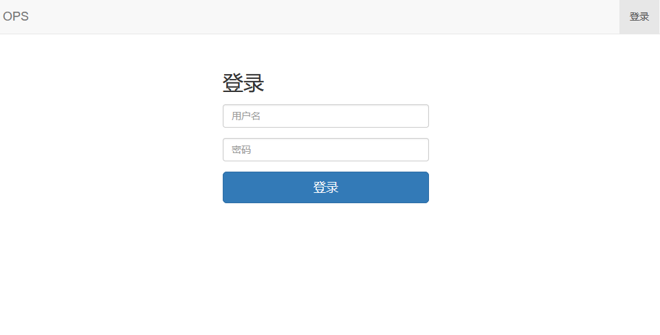
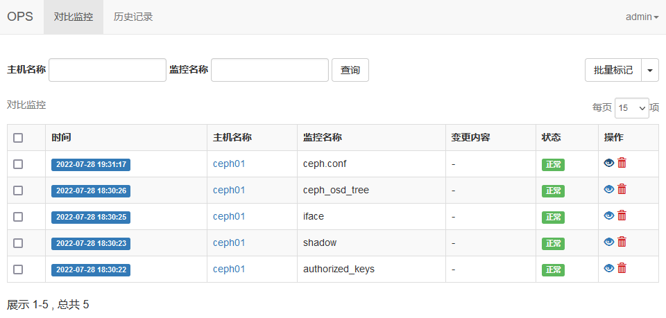
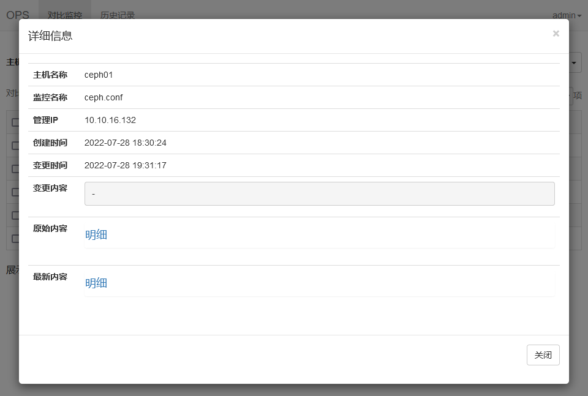
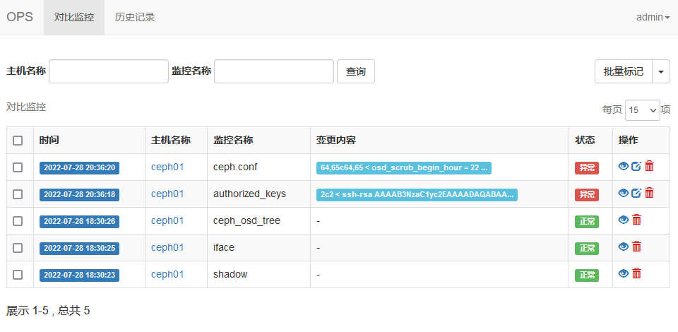
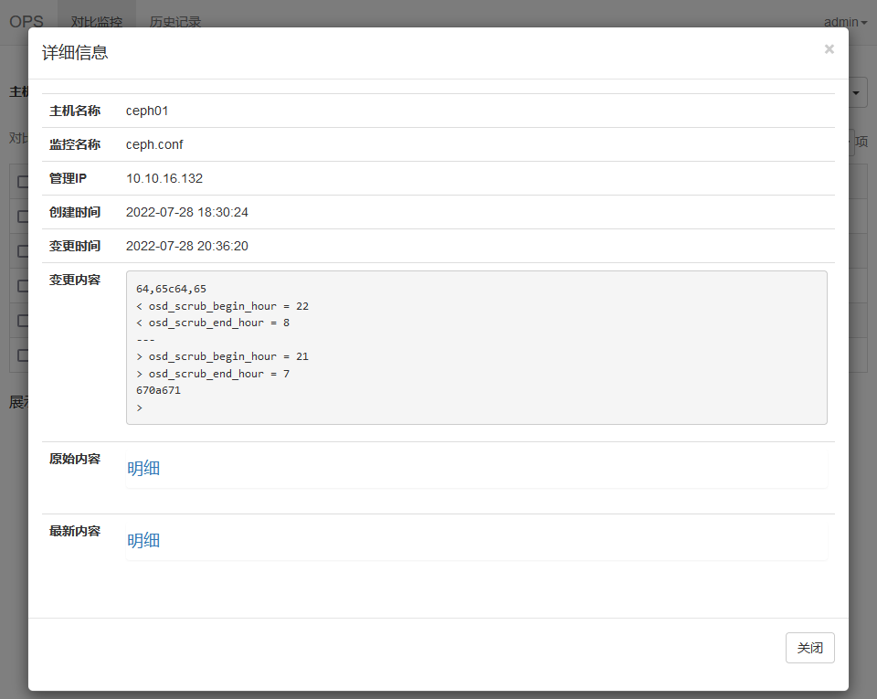
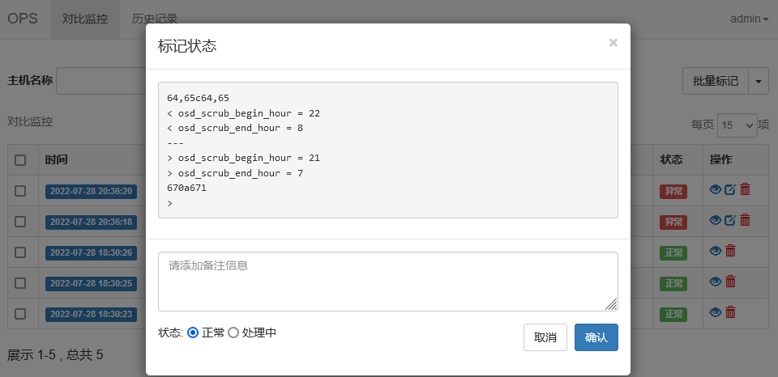
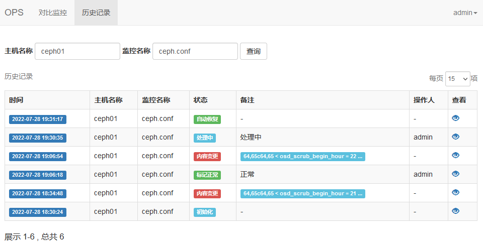

# diffmonitor
对比监控，用于监控服务器上文本类文件（如系统文件、应用配置文件等）的变化或使用命令脚本输出的文本状态的变化（如网卡状态、防火墙规则、磁盘`raid`状态、交换机配置等等）。

> 本程序在 `Python 3.10.2` 下开发

## 服务端部署
> `Docker`部署
```
mkdir /data/diffmonitor -p && cd /data/diffmonitor
touch data.db
echo "SECRET_KEY=`uuidgen | sed 's/-//g'`" >.env
docker run -it -d --name diffmonitor \
    -p 5000:5000 \
    -v /data/diffmonitor/.env:/app/.env \
    -v /data/diffmonitor/data.db:/app/data.db \
    -v /data/diffmonitor/log:/app/log \
    diffmonitor

docker exec -it diffmonitor sh -c "flask initdb" 
```
最后一条命令用于初始化数据库并创建管理员`admin`，密码`Admin123`

## 客户端部署
将监控脚本`client/diff_m.sh`放到指定目录下，如`/opt/diff_m`

### 创建对比配置文件 
`list.conf`
> 根据实际需求添加或删除监控项
```
cat >/opt/diff_m/list.conf <<EOF
authorized_keys file /root/.ssh/authorized_keys
shadow file /etc/shadow
ceph file /etc/ceph/ceph.conf
ceph_osd_tree shell ceph_osd_tree.sh
iface shell iface.sh
EOF
```
- 一行一个监控项，三列分别为：监控名称、监控类型、监控类型对应的文件路径或脚本名；
- 支持两种监控类型：1、file：任意文本文件 2、shell：自定义shell脚本输出文本；脚本需要放到shell目录下；脚本说明见下方
- 如果要取消某项监控，在对应行前面加#或者直接将该行删除；

### 手动执行 
> 脚本可以指定三个参数，服务端地址，主机名和主机IP。
>
> 其中服务端地址必须指定（ip:端口或域名）；主机名可不指定，默认取系统变量$HOSTNAME；主机IP可不指定，默认用127.0.0.1
>
> 比如服务端地址是192.168.10.10:5000，主机名为ceph01，主机IP为10.10.16.132，用如下命令

```
sh diff_m.sh 192.168.10.10:5000 ceph01 10.10.16.132
```

### 定时任务
> 将脚本放到定时任务执行，这里设置每10分钟运行一次
```
grep diff_m.sh /var/spool/cron/root >/dev/null || echo '*/10 * * * * sh /opt/diff_m/diff_m.sh 192.168.10.10:5000 ceph01 10.10.16.32' >>/var/spool/cron/root
```

### 自定义脚本说明
`shell`脚本要能直接输出文本，如`ceph_osd_tree.sh`，就是执行`ceph osd tree`命令，输出`Ceph`集群所有`osd`的状态信息。
```
> cat ceph_osd_tree.sh 
#!/bin/bash
timeout 10 ceph osd tree


> sh ceph_osd_tree.sh
ID WEIGHT    TYPE NAME               UP/DOWN REWEIGHT PRIMARY-AFFINITY 
-6 109.10660 root hdd                                                  
-5  40.00575     host hdd-ceph01                                   
 1   3.63689         osd.1                up  1.00000          1.00000 
 3   3.63689         osd.3                up  1.00000          1.00000 
 0   3.63689         osd.0                up  1.00000          1.00000 
 4   3.63689         osd.4                up  1.00000          1.00000 
 5   3.63689         osd.5                up  1.00000          1.00000 
 2   3.63689         osd.2                up  1.00000          1.00000 
13   3.63689         osd.13               up  1.00000          1.00000 
18   3.63689         osd.18               up  1.00000          1.00000 
19   3.63689         osd.19               up  1.00000          1.00000 
20   3.63689         osd.20               up  1.00000          1.00000 
32   3.63689         osd.32               up  1.00000          1.00000 
-7  29.09509     host hdd-ceph02                                   
 6   3.63689         osd.6                up  1.00000          1.00000
 ......
```

`iface.sh`脚本，输出当前服务器所有物理网卡的状态信息。
```
> cat iface.sh
#!/bin/bash
DEVICE=`ls -l /sys/class/net |grep devices|grep -v "virtual" |awk -F'/' '{print $NF}' |tr '\n' '|'`
mDEVICE="${DEVICE}bond"

ip a |grep "^[[:digit:]]" |grep -E $mDEVICE |grep -v " vif" |awk -F: '{print $2":"$3}' |sort


> sh iface.sh
 eno1: <BROADCAST,MULTICAST,UP,LOWER_UP> mtu 1500 qdisc mq state UP qlen 1000
 eno2: <NO-CARRIER,BROADCAST,MULTICAST,UP> mtu 1500 qdisc mq state DOWN qlen 1000
 eno3: <NO-CARRIER,BROADCAST,MULTICAST,UP> mtu 1500 qdisc mq state DOWN qlen 1000
 eno4: <NO-CARRIER,BROADCAST,MULTICAST,UP> mtu 1500 qdisc mq state DOWN qlen 1000
 enp1s0f0: <BROADCAST,MULTICAST,UP,LOWER_UP> mtu 9000 qdisc mq state UP qlen 1000
 enp1s0f1: <BROADCAST,MULTICAST,UP,LOWER_UP> mtu 1500 qdisc mq state UP qlen 1000
```

这边只是举两个简单的例子，运维人员可根据自身需求编写脚本，并添加到`list.conf`配置文件中。

## 访问web
> 浏览器访问：http://server_ip:5000
>
> 管理员`admin`，默认密码`Admin123`

### 登录页面


### 首页


### 详细信息



### 监控项内容发生变化
#### 首页


#### 详细信息


#### 标记状态


### 历史记录


## 其他
### 权限说明
只有管理员`admin`有删除记录的和批量操作的权限，其他权限和普通用户一致.

### 创建普通用户和修改用户密码
```
docker exec -it diffmonitor sh -c "flask admin --username user --password 123456"
```
> 用户不存在就创建用户，用户存在就修改用户密码

### 使用MySQL数据库
数据库默认使用`sqlite`，如果要使用`MySQL`，需要在`.env`文件添加相关配置
```
DB_DRIVER="mysql"
MYSQL_USER="root"
MYSQL_PASSWORD="password"
MYSQL_HOST="127.0.0.1"
MYSQL_PORT=3306
MYSQL_DATABASE="diffmonitor""
```
然后连接`MySQL`并手动创建数据库 `create database diffmonitor`

最后初始化数据库
```
docker exec -it diffmonitor sh -c "flask initdb"
```

### 历史记录状态说明

| 历史记录状态 | 对应首页状态 | 说明                                 |
| ------------ | ------------ | ------------------------------------ |
| 初始化       | 正常         | 主机监控项初始化                   |
| 内容变更     | 异常         | 监控项内容共发生变化                 |
| 处理中       | 处理中       | 人为将状态标记为处理中               |
| 标记正常     | 正常         | 人为将状态标记为正常                 |
| 自动恢复     | 正常         | 监控项内容变更后，（没有人为标记为正常状态）又恢复成原来的内容 |

