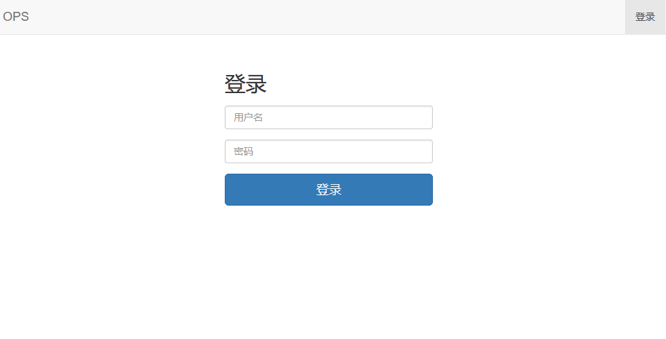
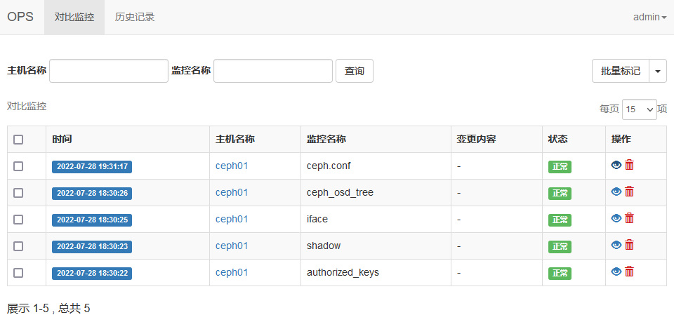
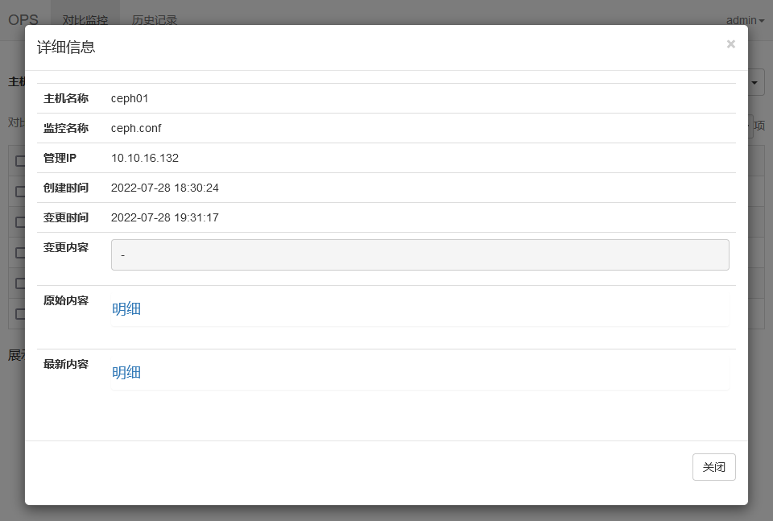
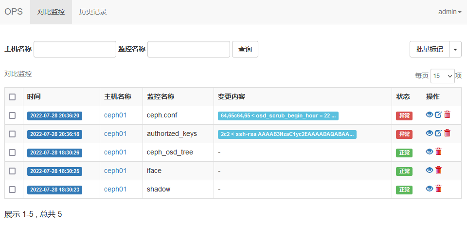
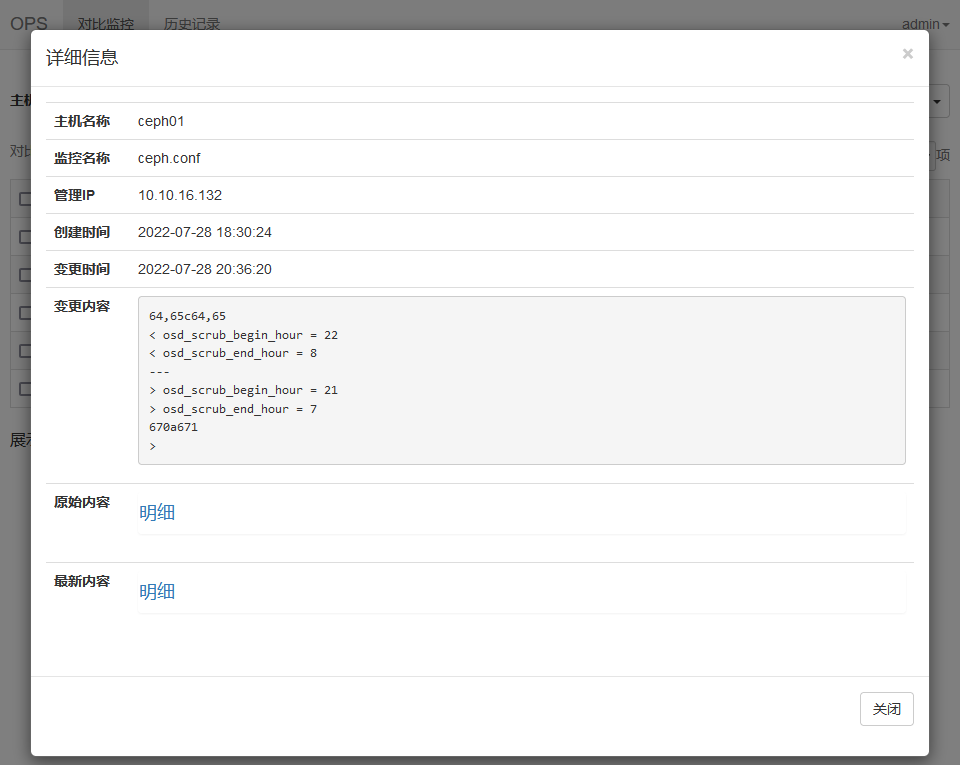
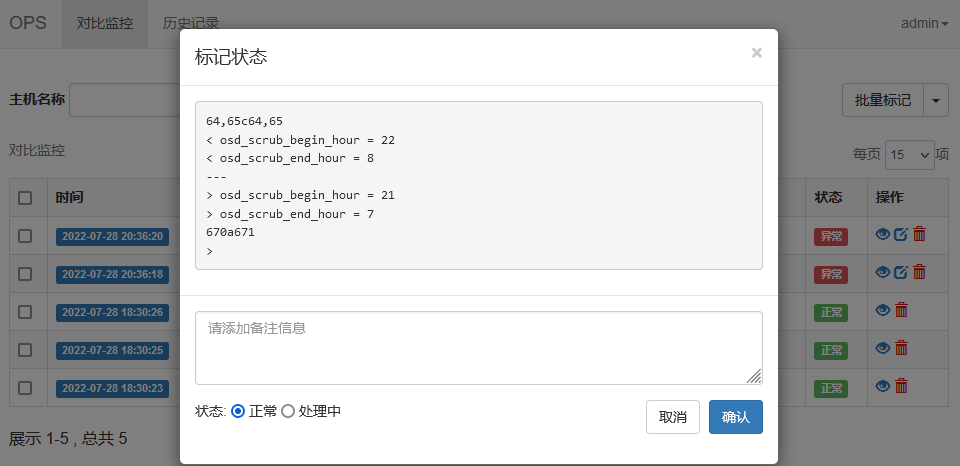
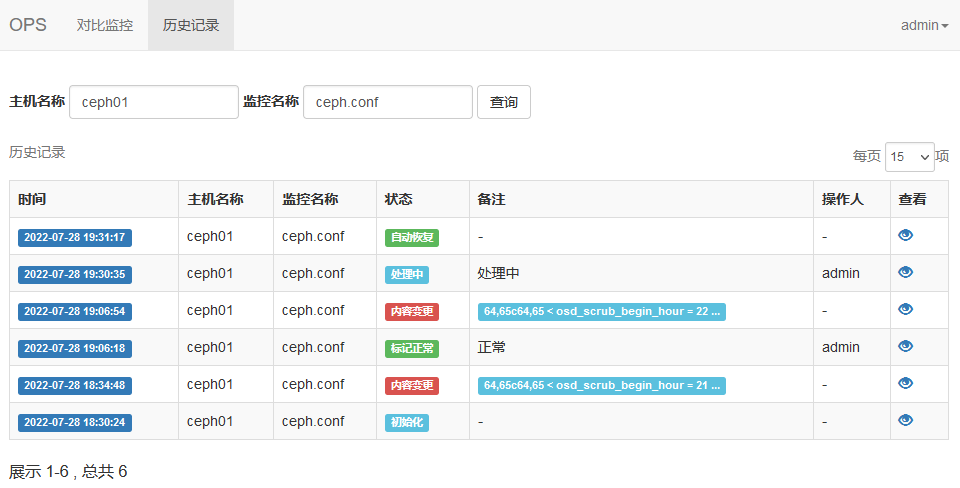

# diffmonitor

Diffmonitor monitors changes in text files on servers (such as system files and application configuration files) or changes in text status output from command scripts (such as NIC status, firewall rules, disk RAID status, switch configuration, and more).

> This application was developed with `Python 3.10.2`.

## Server Deployment

> Docker deployment

```sh
mkdir /data/diffmonitor -p && cd /data/diffmonitor
touch data.db
echo "SECRET_KEY=`uuidgen | sed 's/-//g'`" >.env
echo "API_TOKEN=`uuidgen | sed 's/-//g'`" >>.env
echo "ADMIN_PASSWORD='change-this-to-a-strong-password'" >>.env

docker run -it -d --name diffmonitor \
    -p 5000:5000 \
    -v /data/diffmonitor/.env:/app/.env \
    -v /data/diffmonitor/data.db:/app/data.db \
    -v /data/diffmonitor/log:/app/log \
    cszhi/diffmonitor

docker exec -it diffmonitor sh -c "flask initdb"
```

The last command initializes the database and creates the administrator user `admin`.

The administrator password uses `ADMIN_PASSWORD` from `.env` first. If `ADMIN_PASSWORD` is not configured, the system automatically generates a random password and prints it once in the initialization command output. Save it securely.

`API_TOKEN` is used to authenticate client access to `/api/*` endpoints. If `API_TOKEN` is not configured, the server remains compatible with older clients and does not enable API authentication. Configuring it is recommended in production.

## Client Deployment

Place the monitoring script `client/diff_m.sh` in the target directory, such as `/opt/diff_m`.

If the server is configured with `API_TOKEN`, the client must set the same environment variable:

```sh
export API_TOKEN='API_TOKEN from the server .env file'
```

You can also specify it directly in a scheduled task:

```sh
API_TOKEN='API_TOKEN from the server .env file' sh /opt/diff_m/diff_m.sh 192.168.10.10:5000 ceph01 10.10.16.32
```

### Create the Diff Configuration File

`list.conf`

> Add or remove monitoring items according to your actual needs.

```sh
cat >/opt/diff_m/list.conf <<EOF
authorized_keys file /root/.ssh/authorized_keys hashonly
shadow file /etc/shadow hashonly
ceph file /etc/ceph/ceph.conf
ceph_osd_tree shell ceph_osd_tree.sh
iface shell iface.sh
EOF
```

- Each line defines one monitoring item. The first three columns are: monitoring name, monitoring type, and the file path or script name corresponding to the monitoring type.
- Two monitoring types are supported: `file` for any text file, and `shell` for text output from a custom shell script. Shell scripts must be placed in the `shell` directory. See the script description below.
- The optional fourth column can be set to `hashonly`. When enabled, only `md5`/`newmd5` and change status are saved; original content, latest content, and the full diff are not saved. This is suitable for sensitive files such as `/etc/shadow` and `authorized_keys`.
- To disable a monitoring item, add `#` at the beginning of the corresponding line or delete the line.

### Manual Execution

> The script accepts three arguments: server address, host name, and host IP.
>
> The server address is required (IP:port or domain name). The host name is optional and defaults to the `$HOSTNAME` environment variable. The host IP is optional and defaults to `127.0.0.1`.
>
> For example, if the server address is `192.168.10.10:5000`, the host name is `ceph01`, and the host IP is `10.10.16.132`, run:

```sh
API_TOKEN='API_TOKEN from the server .env file' sh diff_m.sh 192.168.10.10:5000 ceph01 10.10.16.132
```

### Scheduled Task

> Add the script to cron. This example runs it every 10 minutes.

```sh
grep diff_m.sh /var/spool/cron/root >/dev/null || \
    echo '*/10 * * * * sleep ${RANDOM: -1}; API_TOKEN="API_TOKEN from the server .env file" sh /opt/diff_m/diff_m.sh 192.168.10.10:5000 ceph01 10.10.16.32' >>/var/spool/cron/root
```

### Custom Script Description

A `shell` script must directly output text. For example, `ceph_osd_tree.sh` runs `ceph osd tree` and outputs the status information for all OSDs in a Ceph cluster.

```sh
> cat ceph_osd_tree.sh
#!/bin/bash
timeout 10 ceph osd tree


> sh ceph_osd_tree.sh
ID WEIGHT    TYPE NAME               UP/DOWN REWEIGHT PRIMARY-AFFINITY
-6 109.10660 root hdd
-5  40.00575     host hdd-ceph01
 1   3.63689         osd.1                up  1.00000          1.00000
 3   3.63689         osd.3                up  1.00000          1.00000
 0   3.63689         osd.0                up  1.00000          1.00000
 4   3.63689         osd.4                up  1.00000          1.00000
 5   3.63689         osd.5                up  1.00000          1.00000
 2   3.63689         osd.2                up  1.00000          1.00000
13   3.63689         osd.13               up  1.00000          1.00000
18   3.63689         osd.18               up  1.00000          1.00000
19   3.63689         osd.19               up  1.00000          1.00000
20   3.63689         osd.20               up  1.00000          1.00000
32   3.63689         osd.32               up  1.00000          1.00000
-7  29.09509     host hdd-ceph02
 6   3.63689         osd.6                up  1.00000          1.00000
 ......
```

The `iface.sh` script outputs status information for all physical NICs on the current server.

```sh
> cat iface.sh
#!/bin/bash
DEVICE=`ls -l /sys/class/net |grep devices|grep -v "virtual" |awk -F'/' '{print $NF}' |tr '\n' '|'`
mDEVICE="${DEVICE}bond"

ip a |grep "^[[:digit:]]" |grep -E $mDEVICE |grep -v " vif" |awk -F: '{print $2":"$3}' |sort


> sh iface.sh
 eno1: <BROADCAST,MULTICAST,UP,LOWER_UP> mtu 1500 qdisc mq state UP qlen 1000
 eno2: <NO-CARRIER,BROADCAST,MULTICAST,UP> mtu 1500 qdisc mq state DOWN qlen 1000
 eno3: <NO-CARRIER,BROADCAST,MULTICAST,UP> mtu 1500 qdisc mq state DOWN qlen 1000
 eno4: <NO-CARRIER,BROADCAST,MULTICAST,UP> mtu 1500 qdisc mq state DOWN qlen 1000
 enp1s0f0: <BROADCAST,MULTICAST,UP,LOWER_UP> mtu 9000 qdisc mq state UP qlen 1000
 enp1s0f1: <BROADCAST,MULTICAST,UP,LOWER_UP> mtu 1500 qdisc mq state UP qlen 1000
```

These are only two simple examples. Operations engineers can write scripts based on their own requirements and add them to the `list.conf` configuration file.

## Web Access

> Open http://server_ip:5000 in a browser.
>
> The administrator user is `admin`. The password is the `ADMIN_PASSWORD` configured during initialization. If it was not configured, use the random password printed by the initialization command.

### Login Page



### Home Page



### Details



### Monitoring Item Content Changed

#### Home Page



#### Details



#### Mark Status



### History



## Other

### Permission Notes

Only the administrator `admin` can delete records and perform batch operations. Other permissions are the same as normal users.

### Create a Normal User or Change a User Password

```sh
docker exec -it diffmonitor sh -c "flask admin --username user --password 123456"
```

> If the user does not exist, it is created. If the user already exists, its password is changed.

### Use a MySQL Database

The default database is `sqlite`. To use `MySQL`, add the following configuration to the `.env` file:

```env
DB_DRIVER="mysql"
MYSQL_USER="root"
MYSQL_PASSWORD="password"
MYSQL_HOST="127.0.0.1"
MYSQL_PORT=3306
MYSQL_DATABASE="diffmonitor"
```

Then connect to MySQL and manually create the database: `create database diffmonitor`.

Finally, initialize the database:

```sh
docker exec -it diffmonitor sh -c "flask initdb"
```

### History Status Description

| History status | Corresponding home status | Description |
| -------------- | ------------------------- | ----------- |
| Initialized | Normal | Host monitoring item initialized |
| Content changed | Abnormal | Monitoring item content changed |
| Processing | Processing | Status manually marked as processing |
| Marked normal | Normal | Status manually marked as normal |
| Auto recovered | Normal | After monitoring item content changed, it recovered to the original content without being manually marked as normal |


